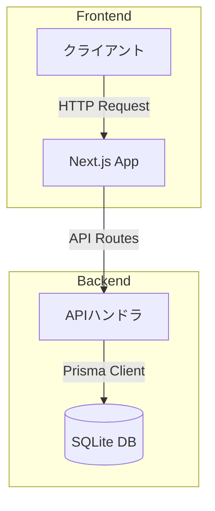
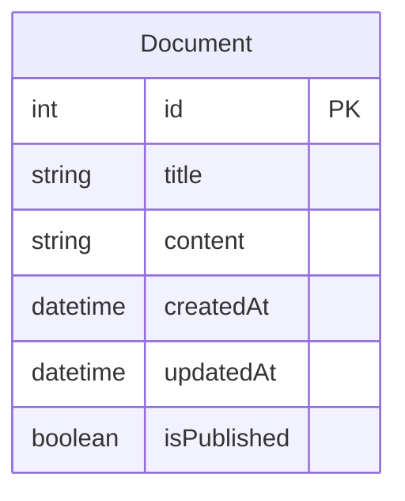
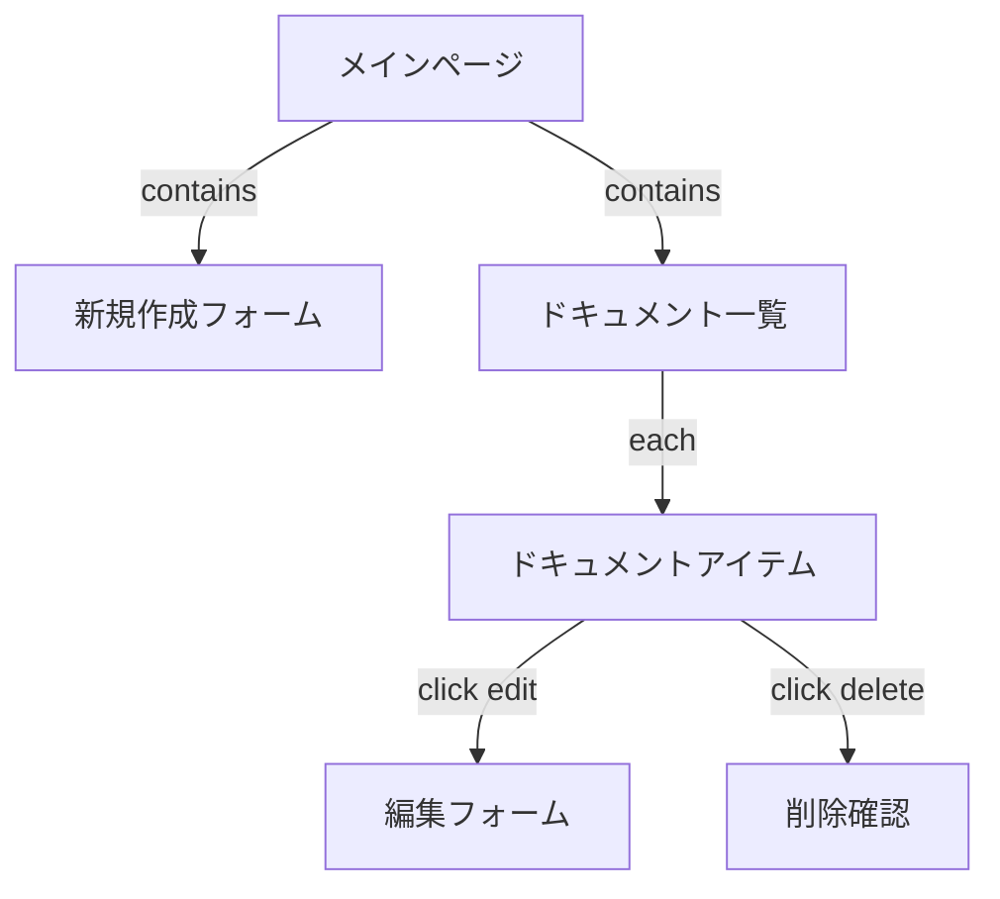
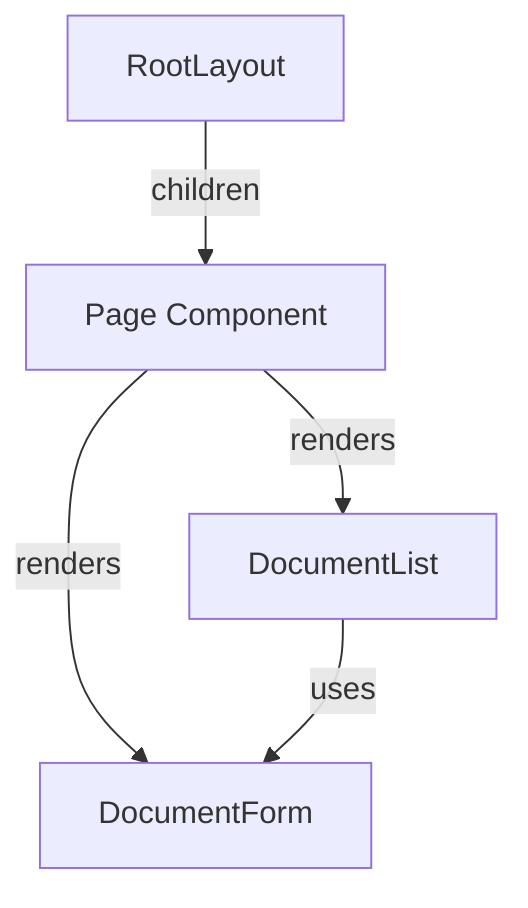

# ドキュメント管理システム

Next.js 13とPrismaを使用したドキュメント管理システムです。

## システム構成図



## データベース設計



## 画面構成



## 主な機能

### バックエンド

#### APIエンドポイント
- `GET /api/documents` - ドキュメント一覧の取得
- `POST /api/documents` - 新規ドキュメントの作成
- `GET /api/documents/[id]` - 特定のドキュメントの取得
- `PUT /api/documents/[id]` - ドキュメントの更新
- `DELETE /api/documents/[id]` - ドキュメントの削除

#### データモデル
```prisma
model Document {
  id          Int      @id @default(autoincrement())
  title       String
  content     String
  createdAt   DateTime @default(now())
  updatedAt   DateTime @updatedAt
  isPublished Boolean  @default(false)
}
```

### フロントエンド

#### コンポーネント構成



#### 実装されたコンポーネント
- `app/page.tsx` - メインページ
- `components/DocumentForm.tsx` - ドキュメント作成・編集フォーム
- `components/DocumentList.tsx` - ドキュメント一覧表示

## 技術スタック

- フレームワーク: Next.js 13 (App Router)
- データベース: SQLite
- ORM: Prisma
- スタイリング: TailwindCSS
- 言語: TypeScript

## API仕様

### ドキュメント作成
```typescript
// POST /api/documents
// Request Body
{
  title: string;
  content: string;
}

// Response
{
  id: number;
  title: string;
  content: string;
  createdAt: string;
  updatedAt: string;
  isPublished: boolean;
}
```

### ドキュメント更新
```typescript
// PUT /api/documents/[id]
// Request Body
{
  title?: string;
  content?: string;
  isPublished?: boolean;
}

// Response
{
  id: number;
  title: string;
  content: string;
  createdAt: string;
  updatedAt: string;
  isPublished: boolean;
}
```

## エラーハンドリング

APIエンドポイントは以下のステータスコードを返します：

- 200: 成功（GET, PUT）
- 201: 作成成功（POST）
- 400: バリデーションエラー
- 404: リソースが見つからない
- 500: サーバーエラー

## セットアップ手順

1. 依存関係のインストール
```bash
pnpm install
```

2. データベースのセットアップ
```bash
pnpm prisma db push
```

3. 開発サーバーの起動
```bash
pnpm dev
```

4. ブラウザでアクセス
```
http://localhost:3000
