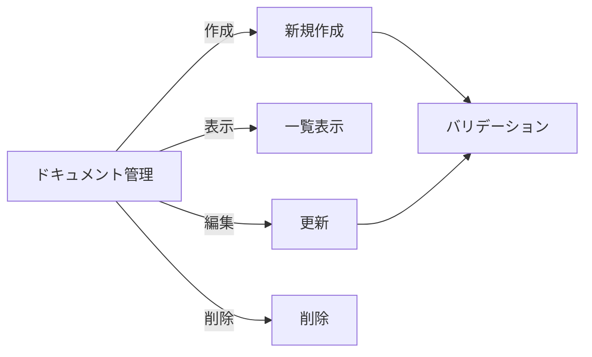
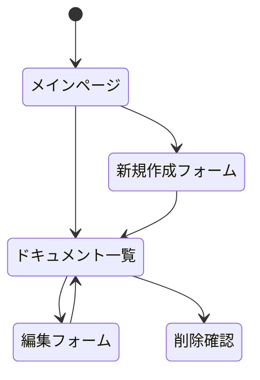

# ドキュメント管理システム 開発仕様書

## 1. システム概要

### 1.1 目的
ドキュメントの作成、管理、共有を効率的に行うためのWebアプリケーション

### 1.2 対象ユーザー
- 社内のドキュメント管理者
- 一般ユーザー

## 2. 機能要件

### 2.1 必須機能

#### 2.1.1 ドキュメント作成機能
- タイトルと本文の入力
- 作成日時の自動記録
- バリデーションチェック

#### 2.1.2 ドキュメント表示機能
- 一覧表示
- 作成日時、更新日時の表示
- 公開状態の表示

#### 2.1.3 ドキュメント編集機能
- タイトルと本文の編集
- 更新日時の自動更新
- 公開状態の切り替え

#### 2.1.4 ドキュメント削除機能
- 削除前の確認ダイアログ
- 削除の取り消し不可

### 2.2 画面遷移

## 3. 非機能要件

### 3.1 パフォーマンス要件
- ページロード時間: 3秒以内
- API応答時間: 1秒以内
- 同時接続数: 100ユーザー程度

### 3.2 セキュリティ要件
- 入力値のサニタイズ
- SQLインジェクション対策
- XSS対策

### 3.3 品質要件
- ブラウザ互換性: 最新のChrome, Firefox, Safari, Edge
- レスポンシブデザイン対応
- エラー処理の完全実装

## 4. 技術スタック選定理由

### 4.1 Next.js
- サーバーサイドレンダリングによるパフォーマンス最適化
- APIルートによるバックエンド統合
- TypeScriptによる型安全性

### 4.2 Prisma
- 型安全なデータベースアクセス
- マイグレーション管理の容易さ
- SQLiteによる開発環境の簡素化

### 4.3 TailwindCSS
- 効率的なスタイリング
- カスタマイズ性の高さ
- ユーティリティファーストアプローチ

## 5. 今後の拡張予定

### 5.1 追加機能案
- ユーザー認証
- ドキュメントの共有機能
- バージョン管理
- 検索機能

### 5.2 改善案
- リアルタイム更新
- ドラッグ&ドロップによるファイル添付
- マークダウンエディタの実装
- ソート・フィルター機能

## 6. テスト要件

### 6.1 単体テスト
- APIエンドポイントのテスト
- コンポーネントのテスト
- バリデーション処理のテスト

### 6.2 統合テスト
- フォーム送信からデータベース保存までのフロー
- 編集・削除操作の一連の流れ

### 6.3 E2Eテスト
- ユーザーシナリオベースのテスト
- クロスブラウザテスト
